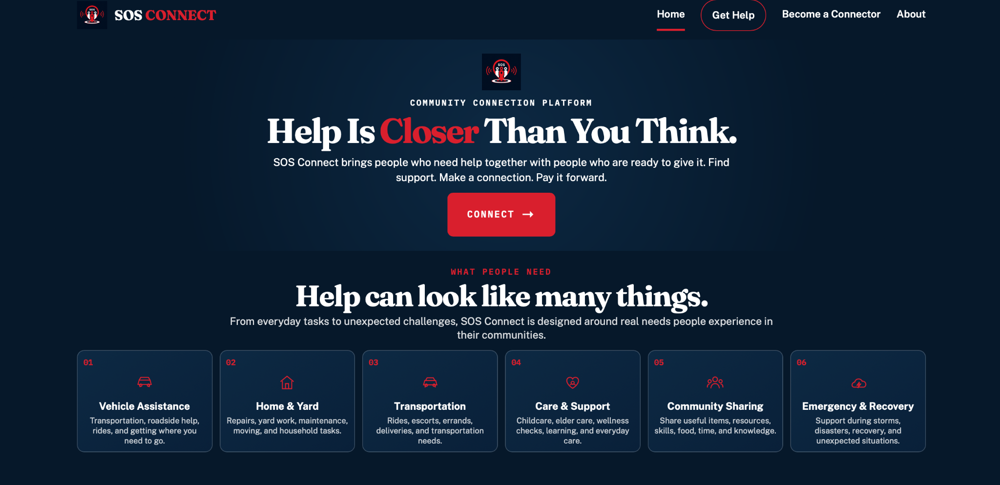

# SOS Connect

### Help Is Closer Than You Think

SOS Connect is a community-driven platform designed to connect people who need assistance with people who are willing to help.

The idea behind SOS Connect is simple: sometimes people need a little help with everyday challenges, but they may not know where to turn. SOS Connect creates a place where people can request help and connect with members of their community who are willing to step in.

## Why SOS Connect?

SOS Connect was created from a desire to make helping others easier and more accessible.

Whether someone needs help getting groceries, transportation, moving an item, completing a daily task, or getting connected to additional support, the goal is to make it easier to ask for help and easier for others to provide it.

## Features

- 🆘 **Request Help** — Submit a request when you need assistance.
- 🤝 **Become a Connector** — Volunteer to help people in your community.
- 📍 **Local Connections** — Help can be connected to people nearby.
- 📋 **Help Categories** — Organize requests by different types of assistance.
- 💻 **Simple Interface** — Designed to make requesting and offering help straightforward.
- 🔒 **Structured Application** — Organized backend architecture for managing application data and functionality.

## Help Categories

SOS Connect is designed to support a variety of everyday needs, including:

### Daily Essentials & Chores
- Grocery assistance
- Household tasks
- Yard work
- Basic errands

### Transportation & Logistics
- Rides
- Transportation assistance
- Moving and delivery help
- Item pickup and drop-off

### Care & Life Support
- Check-ins
- Companionship
- Support with daily activities
- Community assistance

### Emergency & Surplus Sharing
- Food and essential supplies
- Clothing and household items
- Community resource sharing
- Other urgent needs

## Tech Stack

### Backend
- Java
- Maven
- JavaFX

### Frontend
- HTML
- CSS
- JavaScript

### Development Tools
- Git
- GitHub
- Visual Studio Code
- JUnit

## Project Structure

```text
SOSApp/
├── src/
│   ├── main/
│   │   ├── java/
│   │   └── resources/
│   │       └── static/
│   └── test/
├── brand/
├── screenshots/
├── .github/
├── pom.xml
└── README.md
